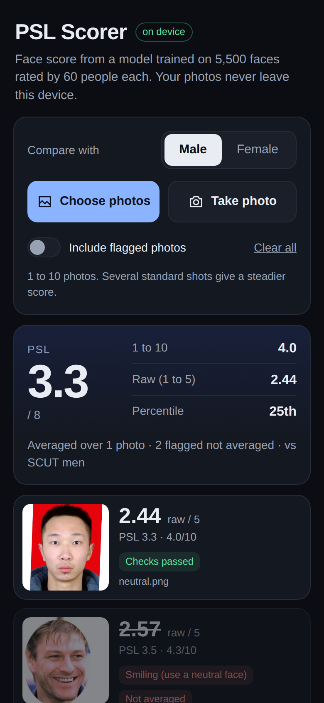

# PSL Scorer

A mobile first web app that scores face photos with a model trained on
[SCUT-FBP5500](https://github.com/HCIILAB/SCUT-FBP5500-Database-Release)
(5,500 faces, each rated 1 to 5 by 60 people). Everything runs in your browser:
no backend, no uploads, no API keys.

**Live:** https://petjamod.github.io/psl-scorer/

<p align="center"></p>

## Accuracy

| | Pearson with the mean human rating | MAE (1 to 5 scale) |
|---|---|---|
| Shipped model, 2,200 held out SCUT test faces (Python, app preprocessing) | **0.921** | 0.200 |
| Same model through the real browser pipeline, 300 test photos (Playwright) | **0.918** (Python on the same 300: 0.918) | 0.197 |
| Pretrained HCIILAB ResNet18 weights, same pipeline, for comparison | 0.910 | 0.216 |

The shipped model is my own ResNet18 (ImageNet start) fine tuned for 54 minutes on CPU on the official 60% train
split only, using the same aligned crops the app produces. It averages the prediction for the photo and its mirror
image. I chose it over the pretrained weights because it scores higher and, unlike those weights, its test number is
provably held out (DECISIONS.md, decision 8).

The same image scored 20 times gives bit identical output, JPEG re-encoding at quality 85 moves the score by
0.02 on average, and the browser tensors match the Python reference exactly.

Full numbers: [VALIDATION.md](VALIDATION.md). Every choice and its reason: [DECISIONS.md](DECISIONS.md).

## How it works

1. **Decode** the photo with EXIF orientation applied (`createImageBitmap(..., { imageOrientation: 'from-image' })`)
   and hash the file (SHA-256).
2. **Face Landmarker** (MediaPipe tasks-vision 1.0.1, CPU) finds the face: 478 landmarks, 52 blendshapes
   and the head pose matrix.
3. **Quality checks**: exactly one face; head turned or tilted more than 15 degrees; smiling or mouth open;
   eyes less than 60 px apart in the original; blur (Laplacian variance); very dark or bright.
4. **Alignment to SCUT framing**: a similarity transform puts the eyes level, 84.9 px apart, with their
   midpoint at (176.3, 159.3) in a 350x350 frame, the average SCUT geometry measured with the same
   Face Landmarker on the 3,300 training images (`web/alignment.json`). You see exactly this crop.
5. **Model**: resize 350 to 256 (a bit exact port of Pillow's bilinear filter), center crop 224,
   ImageNet normalization, ResNet18 in ONNX Runtime Web (WASM, single thread, fp32); the graph averages the
   crop and its mirror image.
6. **Conversions** (`web/config.json`, `web/stats.json`): with the TRAIN label mean and std of the chosen gender,
   `z = (raw - mean) / std`, `PSL = clamp(4 + z, 1, 8)`, `1 to 10 = clamp(5 + 1.5 z, 1, 10)`,
   percentile from the empirical 1..99 table.
7. **Averaging**: photos flagged for pose or expression are greyed out and left out of the average unless
   "Include flagged photos" is on. Spread above 0.4 raw points shows "photos disagree".

**Deterministic:** the pipeline has no randomness, runs single threaded, rounds only for display, and the
result for each file's SHA-256 is cached in localStorage ("seen before"). Verified: the same image scored
20 times gives bit identical float32 output.

**Private and offline:** ONNX Runtime Web 1.30.0, MediaPipe 1.0.1, the face landmarker model and the ONNX
model are all served from this repo (`web/vendor`, `web/models`), no CDN at runtime. A service worker caches
everything, so after the first visit (about 45 MB) it works offline and can be added to the home screen.

## Editing `web/config.json`

| Key | Meaning |
|---|---|
| `conversions.psl` | `PSL = clamp(base + per_z * z, min, max)`, shown with `decimals` |
| `conversions.ten` | same for the 1 to 10 score |
| `conversions.raw_decimals` | decimals of the raw 1 to 5 score |
| `quality.max_pose_deg` | yaw, pitch or roll beyond this (relative to the average SCUT pose) is flagged |
| `quality.smile_threshold`, `quality.jaw_open_threshold` | blendshape score above which the expression is flagged |
| `quality.min_eye_distance_px` | eye distance in the original photo below which the face is "too small" |
| `quality.min_sharpness` | Laplacian variance of the aligned crop below which it is "blurry" |
| `quality.min_brightness`, `quality.max_brightness` | mean face luma limits (0 to 255) |
| `quality.exclude.*` | which flags remove a photo from the average (`true`) or only warn (`false`) |
| `spread_warning` | raw point spread above which "photos disagree" is shown |
| `max_photos` | photos per session |
| `model.*` | model file, byte size (for the progress bar), preprocessing and id. Changing `model.id` resets the score cache |

The z score uses `web/stats.json` (TRAIN labels per gender: mean, std, percentiles). Edits show up on the
next load (the service worker refreshes small files in the background). If you replace the model file, give it
a new name (big files are cached permanently) and update `model.file`, `model.bytes` and `model.id`.

## Repository layout

```
web/                      the static site deployed to GitHub Pages
  index.html, css/, js/   app (plain ES modules, no build step)
  js/pipeline.js          alignment + preprocessing, a line by line port of training/pipeline.py
  models/                 scut_resnet18.onnx, face_landmarker.task
  vendor/                 pinned onnxruntime-web 1.30.0 and @mediapipe/tasks-vision 1.0.1 files
  config.json stats.json alignment.json manifest.webmanifest sw.js
training/                 Python: data, evaluation, fine tuning, export (not deployed)
tests/                    Playwright verification of the real app (tests/verify.mjs)
.github/workflows/pages.yml  deploys web/ on every push to main
```

## Reproduce

```bash
pip install torch==2.5.1 torchvision==0.20.1 --index-url https://download.pytorch.org/whl/cpu
pip install onnx onnxruntime mediapipe==1.0.1 pandas pyarrow pillow scipy
cd training
python prepare_data.py          # downloads SCUT-FBP5500 (HF mirror) and the weights, extracts images
python eval_variants.py         # pretrained weights x preprocessing variants
python landmarks.py             # MediaPipe landmarks for train and test
python align.py                 # web/alignment.json + quality statistics
python stats.py                 # web/stats.json
python finetune.py 55           # own ResNet18, ~1 hour on 4 CPU cores
python compare_models.py && python tta_check.py && python final_eval.py
python export_onnx.py runs/finetuned.pt flip   # web/models/scut_resnet18.onnx
python make_fixtures.py
cd ../tests && npm install && node verify.mjs
cd ../training && python write_validation.py
```

## Limits

It predicts what SCUT-FBP5500's raters would say about this photo. It is not an objective truth: those raters'
taste, mostly young Asian and Caucasian faces, and the photo itself (light, lens distance, angle, expression) all
shape the number. SCUT-FBP5500 is released for non commercial research; check its terms before any other use.

Third party: ONNX Runtime Web (MIT), MediaPipe (Apache 2.0).
